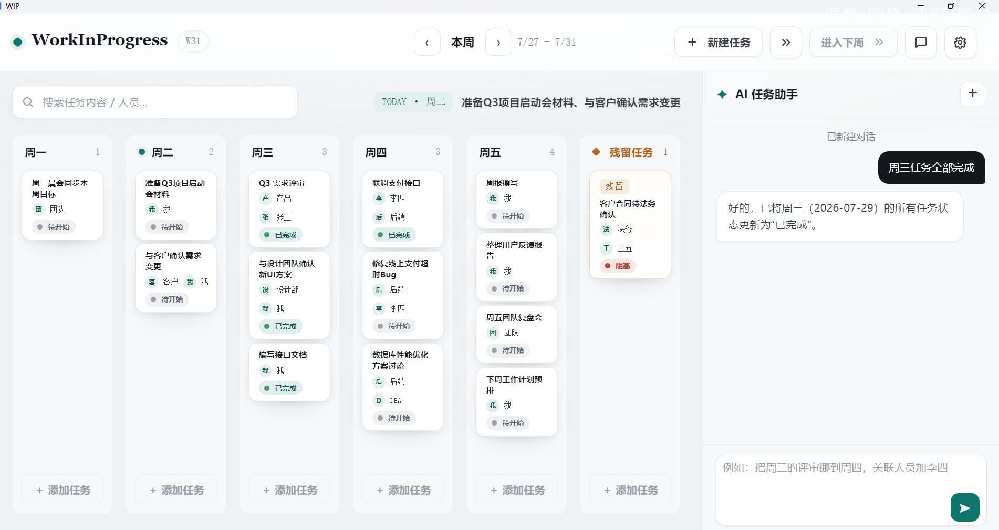

# WIP — Work In Progress

个人周任务看板桌面应用。自然语言对话操控任务，拖拽编排一周。



## ✨ 功能

- 周一至周五 + 残留任务六列看板，支持 5/7 天切换
- 拖拽改列排序，点击轮转状态（待开始 → 进行中 → 已完成 → 阻塞）
- AI 自然语言增删改移任务，流式 SSE + Markdown 渲染
- 任务提醒（到点系统通知 + 应用内 Toast）
- 例行任务（每日/多日重复，完成后自动生成下一周期）
- 撤销/重做（Ctrl+Z/Y），自动跨周结算
- AI 面板宽度拖拽调节并记忆
- API Key 加密存储（Electron safeStorage），支持自定义 OpenAI 接口

## ⌨ 快捷键

| 键 | 操作 |
|---|------|
| Ctrl+N | 新建任务 |
| Ctrl+F | 搜索 |
| Ctrl+Z | 撤销 |
| Ctrl+Y | 重做 |
| Enter | 发送消息 |
| Shift+Enter | 换行 |

## 🛠 技术栈

- Electron 31（Chromium + Node.js）
- 原生 Vanilla JS，模块化 IIFE 架构
- localStorage 持久化 + safeStorage 加密
- OpenAI 兼容 API（流式 SSE）
- electron-builder NSIS 打包

## 🚀 开发

```bash
npm install
npm start
```

## 📦 打包

```bash
npm run dist
# → dist/Work In Progress Setup x.x.x.exe
```
